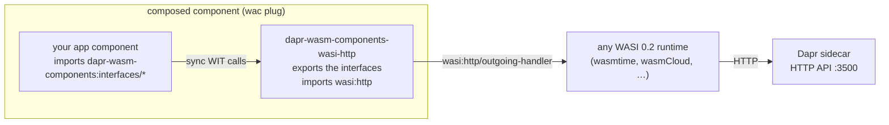

# dapr-wasm-components

[Dapr](https://dapr.io) building blocks for [WebAssembly components](https://component-model.bytecodealliance.org/), as two pure-wasm modules:

- **`dapr-wasm-components-interface`** — the [WIT](https://github.com/WebAssembly/component-model/blob/main/design/mvp/WIT.md) package `dapr-wasm-components:interfaces` (`wit/`): typed, **synchronous** interfaces for every Dapr building block, including the experimental/alpha ones.
- **`dapr-wasm-components-wasi-http`** — a pure-wasm implementation of those interfaces (`components/wasi-http/`): it talks to the Dapr sidecar's [HTTP API](https://docs.dapr.io/reference/api/) through `wasi:http` outgoing requests. No native host, no Dapr SDK — it runs on **any** WASI 0.2 runtime with `wasi:http` support (wasmtime, wasmCloud, Spin, ...).

Write your app against the interfaces, plug it together with the implementation, and run it next to a Dapr sidecar:



## Interfaces (`dapr-wasm-components:interfaces@0.1.0`)

| Interface | Building block | Dapr API status |
|---|---|---|
| `state` | State: get, get-bulk, save, delete, **transactions**, **query** | stable (query: alpha) |
| `pubsub` | Pub/sub: publish, **bulk publish** | stable |
| `bindings` | Output bindings | stable |
| `secrets` | Secrets: get, get-bulk | stable |
| `configuration` | Configuration: get | stable |
| `invocation` | Service invocation with full HTTP semantics (verb, headers, status passthrough) | stable |
| `lock` | Distributed lock: try-lock, unlock | alpha |
| `workflow` | Workflow management: start, get, terminate, raise-event, pause, resume, purge | deprecated-but-served HTTP API |
| `jobs` | Jobs/scheduler: schedule (incl. failure policy), get, delete | stable since 1.16 |
| `crypto` | Cryptography: encrypt, decrypt (one-shot) | alpha |
| `conversation` | Conversation (LLM): converse | alpha2 |
| `actors` | Actors (client side): invoke, state, transactions, reminders, timers | stable |
| `runtime` | Sidecar metadata, labels, health checks | stable |

Worlds: `imports` (everything an app needs) and `provider` (everything an implementation exports).

**Inbound flows** (pub/sub deliveries, input bindings, job triggers, actor hosting, configuration watches) arrive over the application's HTTP app channel — export `wasi:http/incoming-handler` from your app for those. They are intentionally not part of these outbound interfaces.

## Using the published modules

Both modules are published to this repository's OCI registry — tag `latest` tracks `main`, semver tags come from GitHub releases:

```sh
wkg oci pull ghcr.io/sideeffffect/dapr-wasm-components-interface:latest -o interface.wasm
wkg oci pull ghcr.io/sideeffffect/dapr-wasm-components-wasi-http:latest -o dapr.wasm

wasm-tools component wit interface.wasm    # view the interfaces as WIT text
```

## Writing an app (Rust)

```toml
[dependencies]
wit-bindgen = "0.58"
```

```rust
wit_bindgen::generate!({ world: "imports", path: "wit" });

use dapr_wasm_components::interfaces::state;

fn main() {
    state::save(
        "statestore",
        &[state::StateItem {
            key: "k".into(), value: b"v".to_vec(),
            etag: None, metadata: vec![], options: None,
        }],
        &[],
    )
    .unwrap();
}
```

Build, compose, run (see `components/kv-demo/` for the full example):

```sh
cargo build --release --target wasm32-wasip2
wac plug my_app.wasm --plug dapr.wasm -o composed.wasm
dapr run --app-id my-app -- wasmtime run -S http composed.wasm
```

The implementation resolves the sidecar like other Dapr SDKs: `DAPR_HTTP_ENDPOINT`, then `http://127.0.0.1:$DAPR_HTTP_PORT`, then `http://127.0.0.1:3500`; `DAPR_API_TOKEN` is attached as the `dapr-api-token` header when set.

## Repository layout

| Path | What |
|---|---|
| `wit/` | The `dapr-wasm-components:interfaces` WIT package |
| `components/wasi-http/` | The wasi:http implementation component |
| `components/kv-demo/` | Example app component (`wasi:cli` command) |
| `components/order-processor/`, `components/checkout/` | E2E microservices: pub/sub consumer (`wasi:http` server) and publisher/invoker |
| `e2e/` | Test harness: mock-sidecar tests, wac composition, and the real-Dapr E2E |
| `wiki/`, `raw/` | LLM-maintained knowledge base with the research behind the design |

## Development

```sh
rustup target add wasm32-wasip2

cargo fmt --all && cargo fmt --all --manifest-path components/Cargo.toml
cargo build --release --target wasm32-wasip2 --manifest-path components/Cargo.toml
cargo clippy --all-targets -- -D warnings
cargo clippy --target wasm32-wasip2 --manifest-path components/Cargo.toml -- -D warnings
cargo test    # provider tests + composed kv-demo, against a mock sidecar
```

### Real-Dapr end-to-end test

`e2e/tests/dapr.rs` orchestrates two wasm microservices through two **actual `daprd` sidecars**: `checkout` publishes orders via Redis pub/sub, `order-processor` (served by `wasmtime serve`) consumes them into a state store with etag CAS, and `checkout` verifies the result through Dapr service invocation (sqlite name resolution between sidecars). It needs `daprd`, the `wasmtime` CLI, and Redis:

```sh
docker run -d --name dapr-e2e-redis -p 6379:6379 redis:7-alpine
cargo build --release --target wasm32-wasip2 --manifest-path components/Cargo.toml
cargo test --test dapr -- --ignored
```

CI runs this on every push (the `dapr-e2e` job).

## Status & limitations

Experimental.

- The whole Dapr **outbound** HTTP API surface is covered, including alpha APIs (lock, crypto, state query, conversation) — alpha APIs can change with Dapr releases.
- Values in the HTTP state/bindings APIs are JSON: bytes that parse as JSON are sent as-is, anything else is sent as a JSON string (UTF-8 lossy). Store JSON if you need byte-exact roundtrips.
- Crypto is one-shot (no streaming); configuration subscriptions are not exposed (they push to the app channel).
- Conversation models the alpha2 text subset (no tool calling yet).

## License

[Apache-2.0](LICENSE)
