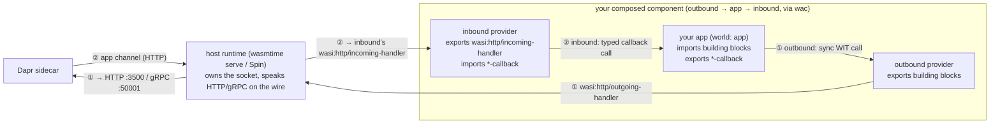

# dapr-wasm-components

[Dapr](https://dapr.io) building blocks for [WebAssembly components](https://component-model.bytecodealliance.org/), as pure-wasm modules:

- **`dapr-wasm-components-interface`** — the [WIT](https://github.com/WebAssembly/component-model/blob/main/design/mvp/WIT.md) package `dapr-wasm-components:interfaces` (`components/wit/`): typed, **synchronous** interfaces for every Dapr building block (the *outbound* direction, app → Dapr) and a set of `*-callback` interfaces (the *inbound* direction, Dapr → app), including the experimental/alpha building blocks.
- **Four provider components** (`components/`) — one per direction × transport, so your app never touches the wire either way:
  - **`-wasi-http-outbound`** / **`-wasi-http-inbound`** — the [HTTP API](https://docs.dapr.io/reference/api/) over `wasi:http`. Portable: any WASI 0.2 runtime with `wasi:http` (wasmtime, wasmCloud, Spin, …). The inbound one exports `wasi:http/incoming-handler` and dispatches the app channel to the typed callbacks.
  - **`-wasi-grpc-outbound`** / **`-wasi-grpc-inbound`** — the [gRPC API](https://docs.dapr.io/reference/api/grpc_api/) (tonic + vendored Dapr protos). Typed protobuf instead of JSON — values roundtrip **byte-exact**. Needs cleartext HTTP/2, which today only [Spin](https://spinframework.dev) ≥ 3.4 provides — see [below](#the-wasi-grpc-provider-spin-only). The inbound one serves Dapr's `AppCallback` gRPC service.
- **`dapr-app`** — the app-side SDK (`app-sdk/`): implement the `DaprApp` trait (every callback method has a default, so you override only what you use) and call Dapr through re-exported typed interfaces. Your application never touches HTTP or gRPC in **either** direction — the providers do.

Write your app against the interfaces, [compose](#composing) it with an outbound + an inbound provider (`wac`), and run it next to a Dapr sidecar. The single diagram in [Two directions](#two-directions-calling-dapr-vs-being-called-by-dapr) below shows the whole picture.

## Interfaces (`dapr-wasm-components:interfaces@0.2.0`)

**Outbound** — interfaces your app *imports* to call Dapr:

| Interface | Building block | Dapr API status |
|---|---|---|
| `state` | State: get, get-bulk, save, delete, **transactions**, **query** | stable (query: alpha) |
| `pubsub` | Pub/sub: publish, **bulk publish** | stable |
| `bindings` | Output bindings | stable |
| `secrets` | Secrets: get, get-bulk | stable |
| `configuration` | Configuration: get, **subscribe**, unsubscribe | stable |
| `invocation` | Service invocation with full HTTP semantics (verb, headers, status passthrough) | stable |
| `lock` | Distributed lock: try-lock, unlock | alpha |
| `workflow` | Workflow management: start, get, terminate, raise-event, pause, resume, purge | deprecated-but-served HTTP API |
| `jobs` | Jobs/scheduler: schedule (incl. failure policy), get, delete | stable since 1.16 |
| `crypto` | Cryptography: encrypt, decrypt (one-shot) | alpha |
| `conversation` | Conversation (LLM): converse | alpha2 |
| `actors` | Actors (client side): invoke, state, transactions, reminders, timers | stable |
| `runtime` | Sidecar metadata, labels, health checks | stable |

**Inbound** — `*-callback` interfaces your app *exports* to be called by Dapr (names mirror Dapr's `AppCallback`):

| Interface | Delivered flow | Functions |
|---|---|---|
| `invocation-callback` | Service-invocation requests | `on-invoke` |
| `pubsub-callback` | Topic subscriptions + deliveries | `list-topic-subscriptions`, `on-topic-event` |
| `bindings-callback` | Input bindings + deliveries | `list-input-bindings`, `on-binding-event` |
| `jobs-callback` | Job triggers | `on-job-event` |
| `actors-callback` | Actor hosting (HTTP app channel only) | `config`, `on-invoke`, `on-timer`, `on-reminder`, `deactivate` |
| `configuration-callback` | Configuration update pushes | `on-configuration-event` |
| `health-callback` | App health checks | `health-check` |

Worlds: **`app`** (an application — imports the building blocks, exports the callbacks), **`dapr-outbound`** (a provider that exports the building blocks) and **`dapr-inbound`** (a provider that imports the callbacks). The two provider directions are *separate components* so the composition graph stays acyclic — see below.

## Two directions: calling Dapr vs. being called by Dapr — both typed

A Dapr application communicates with its sidecar in two directions, and **the providers shield your app from the wire on both**. Your app is pure typed domain logic — it only implements WIT and never opens a socket.

- **Outbound — your app calls Dapr** (state, pub/sub, secrets, service invocation, …). Your app makes a synchronous WIT call on an imported building-block interface; the composed-in **outbound** provider turns it into a sidecar request (over the host's `wasi:http/outgoing-handler`) and blocks until the reply.
- **Inbound — Dapr calls your app** (service invocation, pub/sub deliveries, input bindings, job triggers, actor activations, configuration updates, health). The sidecar hits the *application channel*; the **inbound** provider owns `wasi:http/incoming-handler`, parses each request, and dispatches it as a typed call on the matching `*-callback` interface your app exports.

Why two provider components per transport? A single provider that both *exported* the building blocks and *imported* the callbacks would form an instantiation **cycle** with the app (the app imports the building blocks; the provider imports the callbacks) — which the component model forbids. Splitting outbound from inbound makes the graph acyclic: **`outbound → app → inbound`**.

The two directions are independent, so you mix and match: the portable `wasi-http` **inbound** provider serves the HTTP app channel on any runtime (even behind a `wasi-grpc`-outbound app), while the `wasi-grpc` **inbound** provider serves Dapr's `AppCallback` gRPC service (`--app-protocol grpc`) on a Spin host that accepts inbound h2c.



## Using the published modules

All modules are published to this repository's OCI registry — tag `latest` tracks `main`, semver tags come from GitHub releases:

```sh
ORG=ghcr.io/sideeffffect
wkg oci pull $ORG/dapr-wasm-components-interface:latest        -o interface.wasm
wkg oci pull $ORG/dapr-wasm-components-wasi-http-outbound:latest -o http-outbound.wasm
wkg oci pull $ORG/dapr-wasm-components-wasi-http-inbound:latest  -o http-inbound.wasm
# and likewise -wasi-grpc-outbound / -wasi-grpc-inbound

wasm-tools component wit interface.wasm    # view the interfaces as WIT text
```

## Writing an app (Rust)

Depend on the `dapr-app` SDK, implement the `DaprApp` trait (overriding only the callbacks you use), and export it. Call Dapr through the re-exported interfaces under `dapr_app::dapr`.

```toml
[dependencies]
dapr-app = { git = "https://github.com/sideeffffect/dapr-wasm-components" }
```

```rust
use dapr_app::{callback::pubsub_callback as ps, dapr::state, DaprApp};

struct App;

impl DaprApp for App {
    // Outbound-only apps override nothing. This one also handles a topic:
    fn list_topic_subscriptions() -> Vec<ps::TopicSubscription> {
        vec![ps::TopicSubscription {
            pubsub_name: "pubsub".into(), topic: "orders".into(),
            metadata: vec![], dead_letter_topic: None,
        }]
    }
    fn on_topic_event(event: ps::TopicEvent) -> ps::TopicEventResponse {
        // `event.data` is the domain payload; the envelope is already parsed.
        state::save("statestore", &[state::StateItem {
            key: "last-order".into(), value: event.data,
            etag: None, metadata: vec![], options: None,
        }], &[]).unwrap();
        ps::TopicEventResponse::Success
    }
}

dapr_app::export_app!(App);
```

See `e2e/apps/kv-demo/` for an outbound-only command and `e2e/apps/microservice/` for an inbound reactor.

### Composing

A composed component is `outbound → app → inbound` (acyclic — see [Two directions](#two-directions-calling-dapr-vs-being-called-by-dapr)). Plain `wac plug` can't express it (it would re-export the app's callbacks). The repo ships a [`compose.sh`](compose.sh) wrapper that makes it a one-liner — it resolves the providers (a local `components/target/` release build when present, otherwise an OCI pull with `wkg`) and runs `wac` for you. The two directions are independent, so the transports are picked separately (e.g. gRPC out, HTTP in is valid):

```sh
./compose.sh my_app.wasm                       # http out + http in -> composed.wasm
./compose.sh my_app.wasm --out grpc --in http  # mixed transports
./compose.sh my_app.wasm -o server.wasm --tag 0.2.0   # explicit output + OCI tag

dapr run --app-id my-app -- wasmtime serve -S cli composed.wasm   # reactor (app channel)
# outbound-only command apps: `wac plug app.wasm --plug http-outbound.wasm` + `wasmtime run -S http`
```

Under the hood it invokes the repo's [`compose.wac`](compose.wac) with [`wac`](https://github.com/bytecodealliance/wac); to drive `wac` yourself (or in CI without the wrapper):

```sh
wac compose \
  --dep dapr:app=my_app.wasm \
  --dep dapr:outbound=http-outbound.wasm \
  --dep dapr:inbound=http-inbound.wasm \
  compose.wac -o composed.wasm
```

The outbound provider resolves the sidecar like other Dapr SDKs: `DAPR_HTTP_ENDPOINT`, then `http://127.0.0.1:$DAPR_HTTP_PORT`, then `http://127.0.0.1:3500`; `DAPR_API_TOKEN` is attached as the `dapr-api-token` header when set.

## The wasi-grpc provider (Spin only)

`dapr-wasm-components-wasi-grpc-outbound` exports the identical building blocks — apps don't change, they just compose a different provider — but implements them with a [tonic](https://github.com/hyperium/tonic) client (no `transport` feature) over [`wasi-grpc`](https://github.com/fermyon/wasi-grpc)/`wasi-hyperium`, driven to completion inside each sync export by `spin-executor` (pure `wasi:io` polling). The Dapr v1.18 protos are vendored and the generated client is checked in — no protoc needed to build. The matching `dapr-wasm-components-wasi-grpc-inbound` serves Dapr's `AppCallback` gRPC service (`--app-protocol grpc`) by hand-rolling the gRPC server framing over `wasi:http/incoming-handler` (reusing the same vendored protobuf messages) — it needs a Spin host that accepts **inbound** h2c.

Why bother: protobuf carries values as raw bytes, so binary state values, binding payloads and pub/sub events roundtrip **byte-exact** (the HTTP provider's JSON envelope can't do that), and errors map 1:1 from `grpc-status` codes.

The catch: gRPC requires HTTP/2 end-to-end, `wasi:http` 0.2 leaves the HTTP version to the host, and today only **Spin ≥ 3.4** speaks outbound cleartext HTTP/2 (wasmtime's `wasi:http` is HTTP/1.1-only — there the component instantiates, but calls fail with `unavailable`). Two things must line up, byte-for-byte, on the **same authority string**:

```sh
# on the Spin host process (NOT spin up --env): enables h2c to this one authority
export SPIN_OUTBOUND_H2C_PRIOR_KNOWLEDGE=127.0.0.1:50001
```

```toml
# spin.toml: let the component reach daprd, and point it at the gRPC endpoint
[component.my-app]
source = "composed.wasm"
allowed_outbound_hosts = ["http://127.0.0.1:50001"]
environment = { DAPR_GRPC_ENDPOINT = "http://127.0.0.1:50001" }
```

Endpoint resolution mirrors the SDKs: `DAPR_GRPC_ENDPOINT`, then `http://127.0.0.1:$DAPR_GRPC_PORT`, then `http://127.0.0.1:50001`; `DAPR_API_TOKEN` becomes `dapr-api-token` gRPC metadata. See `e2e/apps/microservice/` and `e2e/tests/spin.rs` for a complete working setup.

Divergences from the wasi-http provider (inherent to the gRPC API): service invocation cannot pass through the target app's exact status code (success is always `200`, non-2xx surfaces as `error`); a missing state/actor key is indistinguishable from a stored empty value; sidecar health checks use `GetMetadata` (daprd has no gRPC health service); crypto's streaming RPCs are driven in one-shot form.

## Repository layout

`components/` holds the published modules (the interface package + four provider components); the app SDK lives in `app-sdk/`; everything that exists only to test them lives under `e2e/`.

| Path | What |
|---|---|
| `components/wit/` | The `dapr-wasm-components:interfaces` WIT package (worlds `app`, `dapr-outbound`, `dapr-inbound`) |
| `components/wasi-http-outbound/` | wasi:http **outbound** provider — the building blocks over the Dapr HTTP API (portable) |
| `components/wasi-http-inbound/` | wasi:http **inbound** provider — exports `wasi:http/incoming-handler`, dispatches the app channel to the typed callbacks (portable) |
| `components/wasi-grpc-outbound/` | wasi:grpc **outbound** provider — the building blocks over the Dapr gRPC API (Spin ≥ 3.4; vendored protos + checked-in tonic codegen) |
| `components/wasi-grpc-inbound/` | wasi:grpc **inbound** provider — serves Dapr's `AppCallback` gRPC service over `wasi:http/incoming-handler` (Spin h2c inbound), dispatching to the typed callbacks |
| `app-sdk/dapr-app/` | The app-side `dapr-app` SDK (`DaprApp` trait + `export_app!`); wasm-only |
| `compose.wac` / `compose.sh` | The `outbound → app → inbound` composition graph, and a wrapper that resolves the providers and runs `wac` as a one-liner |
| `e2e/` | Test harness: mock-sidecar tests, wac composition, and the real-Dapr E2Es (shared scenario in `tests/common/`) |
| `e2e/apps/` | Demo/fixture app components the E2Es compose and drive (their own wasm-only workspace) |
| `e2e/apps/kv-demo/` | Outbound-only example (`wasi:cli` command), used by the mock composition test |
| `e2e/apps/microservice/` | The real-Dapr E2E app (a typed reactor): run as two instances (publisher + consumer) by **both** suites to exercise state, pub/sub and service invocation |
| `wiki/`, `raw/` | LLM-maintained knowledge base with the research behind the design |

## Development

There are four Cargo workspaces: the native `e2e` harness (root), the published providers (`components/`, wasm-only), the app SDK (`app-sdk/`, wasm-only), and the demo apps (`e2e/apps/`, wasm-only).

```sh
rustup target add wasm32-wasip2

# format / build / lint each wasm workspace, plus the native harness
cargo fmt --all
cargo fmt --all --manifest-path components/Cargo.toml
cargo fmt --all --manifest-path app-sdk/Cargo.toml
cargo fmt --all --manifest-path e2e/apps/Cargo.toml
cargo build --release --target wasm32-wasip2 --manifest-path components/Cargo.toml
cargo build --release --target wasm32-wasip2 --manifest-path app-sdk/Cargo.toml
cargo build --release --target wasm32-wasip2 --manifest-path e2e/apps/Cargo.toml
cargo clippy --all-targets -- -D warnings
cargo clippy --target wasm32-wasip2 --manifest-path components/Cargo.toml -- -D warnings
cargo clippy --target wasm32-wasip2 --manifest-path app-sdk/Cargo.toml -- -D warnings
cargo clippy --target wasm32-wasip2 --manifest-path e2e/apps/Cargo.toml -- -D warnings
cargo test    # provider tests + composed kv-demo, against a mock sidecar
```

### Real-Dapr end-to-end test

Both real-Dapr suites run the **same scenario** (`e2e/tests/common/run_mirrored_scenario`) so they mirror each other and differ only in provider + runtime. The `microservice` app is run as two instances — a `publisher` and a `consumer` — each behind its own **actual `daprd` sidecar**; the scenario drives a state roundtrip + etag CAS + delete, service invocation (self and cross-app), and a cross-sidecar pub/sub publish→deliver→count loop. Pub/sub is Redis (cross-sidecar), name resolution is sqlite (deterministic in CI). All infrastructure — both `daprio/daprd` sidecars and Redis — is started by the test itself with [testcontainers](https://rust.testcontainers.org/).

`e2e/tests/dapr.rs` (**wasi-http** provider) serves the instances with `wasmtime serve`; you only need Docker and the `wasmtime` CLI:

```sh
cargo build --release --target wasm32-wasip2 --manifest-path components/Cargo.toml  # the provider
cargo build --release --target wasm32-wasip2 --manifest-path e2e/apps/Cargo.toml     # the microservice
cargo test --test dapr -- --ignored
```

`e2e/tests/spin.rs` (**wasi-grpc** provider) is the gRPC mirror: it serves the same two instances with the `spin` CLI (the only runtime with outbound h2c), and additionally asserts a *binary* byte-exact state roundtrip — something only the gRPC provider can do. Requires Docker and `spin` ≥ 3.4 (override with `SPIN_BIN`):

```sh
cargo build --release --target wasm32-wasip2 --manifest-path components/Cargo.toml  # the provider
cargo build --release --target wasm32-wasip2 --manifest-path e2e/apps/Cargo.toml     # the microservice
cargo test --test spin -- --ignored
```

CI runs both on every push (the `dapr-e2e` and `spin-e2e` jobs).

## Status & limitations

Experimental. Tracked follow-up work lives in [ROADMAP.md](ROADMAP.md).

- The whole Dapr **outbound** HTTP API surface is covered, including alpha APIs (lock, crypto, state query, conversation) — alpha APIs can change with Dapr releases.
- Values in the HTTP state/bindings APIs are JSON: bytes that parse as JSON are sent as-is, anything else is sent as a JSON string (UTF-8 lossy). Store JSON if you need byte-exact roundtrips — **or use the wasi-grpc provider**, where values are raw protobuf bytes.
- Crypto is one-shot (no streaming). Conversation models the alpha2 text subset (no tool calling yet).
- **Inbound (Dapr → app) is typed via the `*-callback` interfaces**, implemented by the **`wasi-http-inbound`** provider (full HTTP app-channel router) and the `dapr-app` SDK; both real-Dapr E2Es exercise it (pub/sub delivery + service invocation, self and cross-app). Pub/sub is single-route-per-topic (no CEL routing rules or bulk subscribe yet); input-binding response field names follow the bindings API reference and are pending an integration check; configuration-update delivery (`configuration-callback`) is wired in the router (`POST /configuration/<store>/<key>`) and covered by a composed in-process test.
- **Inbound transport is independent of outbound.** The portable `wasi-http-inbound` provider serves the HTTP app channel on any runtime (including behind a `wasi-grpc`-outbound app). The `wasi-grpc-inbound` provider serves Dapr's `AppCallback` gRPC service (`--app-protocol grpc`); it is verified working over Spin's inbound h2c with `grpcurl` (`ListTopicSubscriptions`, `HealthCheck`) but does not yet have an automated daprd `--app-protocol grpc` E2E. Actor *hosting* is HTTP-only regardless, since Dapr's `AppCallback` has no actor methods.
- The wasi-grpc (outbound) provider remains a proof of concept: it runs only on Spin ≥ 3.4 (outbound h2c), its h2c allowlist holds a single authority, and most interfaces are compile-checked but only the E2E surface (state, invocation, pub/sub, metadata) is integration-tested.

## License

[Apache-2.0](LICENSE)
