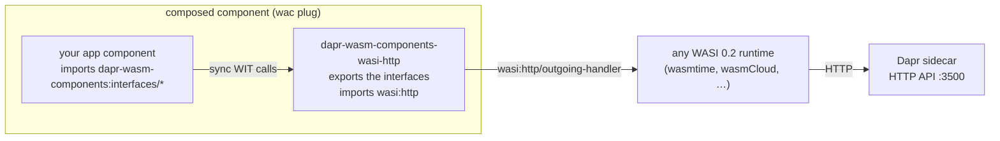
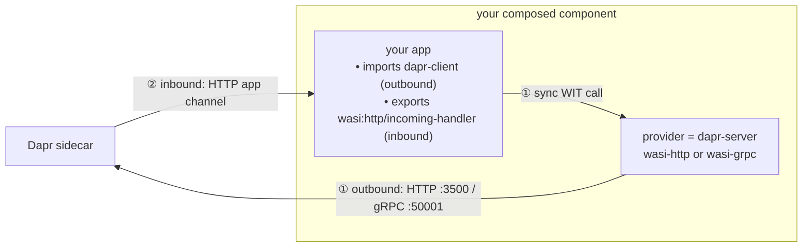

# dapr-wasm-components

[Dapr](https://dapr.io) building blocks for [WebAssembly components](https://component-model.bytecodealliance.org/), as pure-wasm modules:

- **`dapr-wasm-components-interface`** — the [WIT](https://github.com/WebAssembly/component-model/blob/main/design/mvp/WIT.md) package `dapr-wasm-components:interfaces` (`components/wit/`): typed, **synchronous** interfaces for every Dapr building block, including the experimental/alpha ones.
- **`dapr-wasm-components-wasi-http`** — a pure-wasm implementation of those interfaces (`components/wasi-http/`): it talks to the Dapr sidecar's [HTTP API](https://docs.dapr.io/reference/api/) through `wasi:http` outgoing requests. No native host, no Dapr SDK — it runs on **any** WASI 0.2 runtime with `wasi:http` support (wasmtime, wasmCloud, Spin, ...).
- **`dapr-wasm-components-wasi-grpc`** — a second, experimental implementation (`components/wasi-grpc/`): the same interfaces over the sidecar's [gRPC API](https://docs.dapr.io/reference/api/grpc_api/) (tonic + vendored Dapr protos over `wasi:http` outgoing HTTP/2). Typed protobuf instead of JSON — state/bindings/pubsub values roundtrip **byte-exact**. gRPC needs cleartext HTTP/2, which today only [Spin](https://spinframework.dev) ≥ 3.4 provides for outbound requests — see [below](#the-wasi-grpc-provider-spin-only).

Write your app against the interfaces, plug it together with the implementation, and run it next to a Dapr sidecar:



## Interfaces (`dapr-wasm-components:interfaces@0.1.0`)

| Interface | Building block | Dapr API status |
|---|---|---|
| `state` | State: get, get-bulk, save, delete, **transactions**, **query** | stable (query: alpha) |
| `pubsub` | Pub/sub: publish, **bulk publish** | stable |
| `bindings` | Output bindings | stable |
| `secrets` | Secrets: get, get-bulk | stable |
| `configuration` | Configuration: get | stable |
| `invocation` | Service invocation with full HTTP semantics (verb, headers, status passthrough) | stable |
| `lock` | Distributed lock: try-lock, unlock | alpha |
| `workflow` | Workflow management: start, get, terminate, raise-event, pause, resume, purge | deprecated-but-served HTTP API |
| `jobs` | Jobs/scheduler: schedule (incl. failure policy), get, delete | stable since 1.16 |
| `crypto` | Cryptography: encrypt, decrypt (one-shot) | alpha |
| `conversation` | Conversation (LLM): converse | alpha2 |
| `actors` | Actors (client side): invoke, state, transactions, reminders, timers | stable |
| `runtime` | Sidecar metadata, labels, health checks | stable |

Worlds: **`dapr-client`** (everything an app imports to call Dapr) and **`dapr-server`** (everything a provider exports to implement those interfaces). An app targets `dapr-client`; a provider implements `dapr-server`; `wac plug` wires them together.

## Two directions: calling Dapr vs. being called by Dapr

A Dapr application communicates with its sidecar in two independent directions. These components handle **only the outbound one**:

- **Outbound — your app calls Dapr** (state, pub/sub, secrets, service invocation, …). This is exactly what the `dapr-client` interfaces cover and what a provider implements. Your app makes a synchronous WIT call; the composed-in provider (`dapr-server`) translates it into a sidecar request and blocks until the reply. **This is the only direction the two providers differ on:**
  - `dapr-wasm-components-wasi-http` sends HTTP requests to the sidecar's HTTP API (`:3500`) via `wasi:http`.
  - `dapr-wasm-components-wasi-grpc` makes gRPC calls to the sidecar's gRPC API (`:50001`) over `wasi:http` HTTP/2.

- **Inbound — Dapr calls your app** (pub/sub deliveries, input bindings, service-invocation handlers, job triggers, actor activations, configuration updates). In Dapr these arrive on the *application channel*. **Neither provider is involved**: the app itself exports `wasi:http/incoming-handler`, and the sidecar makes ordinary HTTP requests to it. This is **identical whichever provider you pick** — the outbound transport (HTTP or gRPC) and the inbound app-channel transport are configured independently. So a wasi-grpc app calls Dapr over gRPC yet still receives its pub/sub events over HTTP; the two directions are orthogonal.

  (Dapr *can* drive an app channel over gRPC instead, but that requires the app to implement Dapr's `AppCallback` gRPC service. These components deliberately keep the app channel on HTTP — `wasi:http/incoming-handler` is something every WASI 0.2 runtime can serve, gRPC is not.)



## Using the published modules

Both modules are published to this repository's OCI registry — tag `latest` tracks `main`, semver tags come from GitHub releases:

```sh
wkg oci pull ghcr.io/sideeffffect/dapr-wasm-components-interface:latest -o interface.wasm
wkg oci pull ghcr.io/sideeffffect/dapr-wasm-components-wasi-http:latest -o dapr.wasm

wasm-tools component wit interface.wasm    # view the interfaces as WIT text
```

## Writing an app (Rust)

```toml
[dependencies]
wit-bindgen = "0.58"
```

```rust
wit_bindgen::generate!({ world: "dapr-client", path: "wit" });

use dapr_wasm_components::interfaces::state;

fn main() {
    state::save(
        "statestore",
        &[state::StateItem {
            key: "k".into(), value: b"v".to_vec(),
            etag: None, metadata: vec![], options: None,
        }],
        &[],
    )
    .unwrap();
}
```

Build, compose, run (see `e2e/apps/kv-demo/` for the full example):

```sh
cargo build --release --target wasm32-wasip2
wac plug my_app.wasm --plug dapr.wasm -o composed.wasm
dapr run --app-id my-app -- wasmtime run -S http composed.wasm
```

The implementation resolves the sidecar like other Dapr SDKs: `DAPR_HTTP_ENDPOINT`, then `http://127.0.0.1:$DAPR_HTTP_PORT`, then `http://127.0.0.1:3500`; `DAPR_API_TOKEN` is attached as the `dapr-api-token` header when set.

## The wasi-grpc provider (Spin only)

`dapr-wasm-components-wasi-grpc` exports the identical interfaces — apps don't change, they just `wac plug` a different provider — but implements them with a [tonic](https://github.com/hyperium/tonic) client (no `transport` feature) over [`wasi-grpc`](https://github.com/fermyon/wasi-grpc)/`wasi-hyperium`, driven to completion inside each sync export by `spin-executor` (pure `wasi:io` polling). The Dapr v1.18 protos are vendored and the generated client is checked in — no protoc needed to build.

Why bother: protobuf carries values as raw bytes, so binary state values, binding payloads and pub/sub events roundtrip **byte-exact** (the HTTP provider's JSON envelope can't do that), and errors map 1:1 from `grpc-status` codes.

The catch: gRPC requires HTTP/2 end-to-end, `wasi:http` 0.2 leaves the HTTP version to the host, and today only **Spin ≥ 3.4** speaks outbound cleartext HTTP/2 (wasmtime's `wasi:http` is HTTP/1.1-only — there the component instantiates, but calls fail with `unavailable`). Two things must line up, byte-for-byte, on the **same authority string**:

```sh
# on the Spin host process (NOT spin up --env): enables h2c to this one authority
export SPIN_OUTBOUND_H2C_PRIOR_KNOWLEDGE=127.0.0.1:50001
```

```toml
# spin.toml: let the component reach daprd, and point it at the gRPC endpoint
[component.my-app]
source = "composed.wasm"
allowed_outbound_hosts = ["http://127.0.0.1:50001"]
environment = { DAPR_GRPC_ENDPOINT = "http://127.0.0.1:50001" }
```

Endpoint resolution mirrors the SDKs: `DAPR_GRPC_ENDPOINT`, then `http://127.0.0.1:$DAPR_GRPC_PORT`, then `http://127.0.0.1:50001`; `DAPR_API_TOKEN` becomes `dapr-api-token` gRPC metadata. See `e2e/apps/spin-demo/` and `e2e/tests/spin.rs` for a complete working setup.

Divergences from the wasi-http provider (inherent to the gRPC API): service invocation cannot pass through the target app's exact status code (success is always `200`, non-2xx surfaces as `error`); a missing state/actor key is indistinguishable from a stored empty value; sidecar health checks use `GetMetadata` (daprd has no gRPC health service); crypto's streaming RPCs are driven in one-shot form.

## Repository layout

`components/` holds exactly the three things that get published; everything that exists only to test them lives under `e2e/`.

| Path | What |
|---|---|
| `components/wit/` | The `dapr-wasm-components:interfaces` WIT package (worlds `dapr-client`, `dapr-server`) |
| `components/wasi-http/` | The wasi:http implementation component (portable) |
| `components/wasi-grpc/` | The gRPC implementation component (Spin ≥ 3.4; vendored Dapr protos + checked-in tonic codegen) |
| `e2e/` | Test harness: mock-sidecar tests, wac composition, and the real-Dapr E2Es |
| `e2e/apps/` | Demo/fixture app components the E2Es compose and drive (their own wasm-only workspace) |
| `e2e/apps/kv-demo/` | Example app component (`wasi:cli` command) |
| `e2e/apps/order-processor/`, `e2e/apps/checkout/` | wasi-http E2E microservices: pub/sub consumer (`wasi:http` server) and publisher/invoker |
| `e2e/apps/spin-demo/` | wasi-grpc E2E microservice (state, invocation, pub/sub under Spin) |
| `wiki/`, `raw/` | LLM-maintained knowledge base with the research behind the design |

## Development

There are three Cargo workspaces: the native `e2e` harness (root), the published providers (`components/`, wasm-only), and the demo apps (`e2e/apps/`, wasm-only).

```sh
rustup target add wasm32-wasip2

# format / build / lint each wasm workspace, plus the native harness
cargo fmt --all
cargo fmt --all --manifest-path components/Cargo.toml
cargo fmt --all --manifest-path e2e/apps/Cargo.toml
cargo build --release --target wasm32-wasip2 --manifest-path components/Cargo.toml
cargo build --release --target wasm32-wasip2 --manifest-path e2e/apps/Cargo.toml
cargo clippy --all-targets -- -D warnings
cargo clippy --target wasm32-wasip2 --manifest-path components/Cargo.toml -- -D warnings
cargo clippy --target wasm32-wasip2 --manifest-path e2e/apps/Cargo.toml -- -D warnings
cargo test    # provider tests + composed kv-demo, against a mock sidecar
```

### Real-Dapr end-to-end test

`e2e/tests/dapr.rs` orchestrates two wasm microservices through two **actual `daprd` sidecars**: `checkout` publishes orders via Redis pub/sub, `order-processor` (served by `wasmtime serve`) consumes them into a state store with etag CAS, and `checkout` verifies the result through Dapr service invocation (sqlite name resolution between sidecars). All infrastructure — both `daprio/daprd` sidecars and Redis — is started by the test itself with [testcontainers](https://rust.testcontainers.org/); you only need Docker and the `wasmtime` CLI:

```sh
cargo build --release --target wasm32-wasip2 --manifest-path components/Cargo.toml  # the provider
cargo build --release --target wasm32-wasip2 --manifest-path e2e/apps/Cargo.toml     # the demo apps
cargo test --test dapr -- --ignored
```

A second E2E (`e2e/tests/spin.rs`) covers the **wasi-grpc** provider: `spin-demo` composed with it runs under the `spin` CLI (which doubles as the Dapr app channel) next to a daprd testcontainer, asserting a byte-exact binary state roundtrip with etag CAS, service invocation out over gRPC and back in through the app channel, and a pub/sub publish→deliver→count loop — all over the sidecar's gRPC API. Requires Docker and `spin` ≥ 3.4 (override with `SPIN_BIN`):

```sh
cargo build --release --target wasm32-wasip2 --manifest-path components/Cargo.toml  # the provider
cargo build --release --target wasm32-wasip2 --manifest-path e2e/apps/Cargo.toml     # spin-demo
cargo test --test spin -- --ignored
```

CI runs both on every push (the `dapr-e2e` and `spin-e2e` jobs).

## Status & limitations

Experimental.

- The whole Dapr **outbound** HTTP API surface is covered, including alpha APIs (lock, crypto, state query, conversation) — alpha APIs can change with Dapr releases.
- Values in the HTTP state/bindings APIs are JSON: bytes that parse as JSON are sent as-is, anything else is sent as a JSON string (UTF-8 lossy). Store JSON if you need byte-exact roundtrips — **or use the wasi-grpc provider**, where values are raw protobuf bytes.
- Crypto is one-shot (no streaming); configuration subscriptions are not exposed (they push to the app channel).
- Conversation models the alpha2 text subset (no tool calling yet).
- The wasi-grpc provider is a proof of concept: it runs only on Spin ≥ 3.4 (outbound h2c), its h2c allowlist holds a single authority, and its `/smoke`-level surface (state, invocation, pub/sub, metadata) is what the E2E exercises — the remaining interfaces are implemented and compile-checked but not yet integration-tested.

## License

[Apache-2.0](LICENSE)
