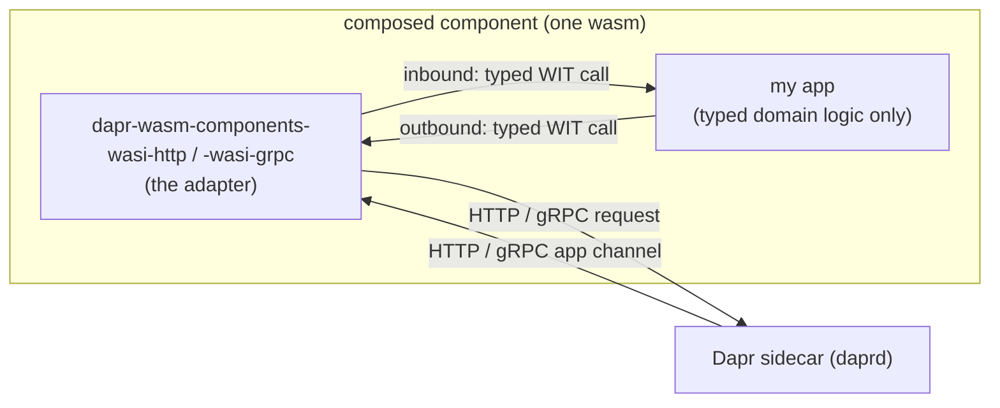
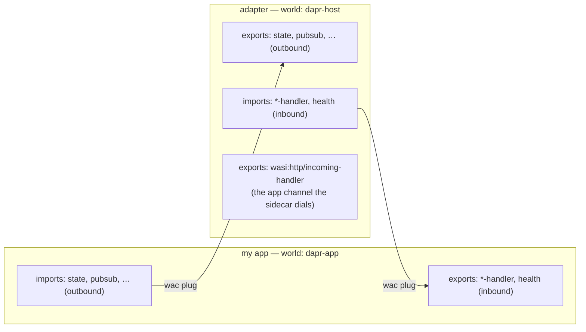
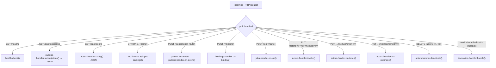

# dapr-wasm-components — Inbound Design (Dapr → app, typed)

> Status: **partially implemented** (2026-06-13). Authored from a design interview with Ondra, then built. Supersedes the prior "inbound goes through a plain `wasi:http/incoming-handler` on the app" decision in [Architecture](dapr-wasm-components-architecture.md) (§Key decisions, "Outbound only").
>
> **As-built so far:** the WIT (seven `*-callback` interfaces + outbound `configuration.subscribe`/`unsubscribe`, package `@0.2.0`); the worlds **`app`**, **`outbound`** and **`inbound`** (not the `dapr-app`/`dapr-host` working names below); the **wasi-http** inbound provider (`wasi-http-inbound`) + config subscribe; the **`dapr-app`** app-side SDK (`app-sdk/`, the "trivial defaults via Rust helper" decision realized as a `DaprApp` trait with default methods + blanket Guest impls + a cross-crate `export_app!`); and all four demo apps migrated to it. **Remaining:** the wasi-grpc `AppCallback` server transport; the native e2e harness + test-flow rework; README/CI updates. Callback function names follow Dapr's `AppCallback` proto (`on-invoke`, `list-topic-subscriptions`/`on-topic-event`, `list-input-bindings`/`on-binding-event`, `on-job-event`, `health-check`).
>
> Naming note: the working names `dapr-app`/`dapr-host` used below were superseded during implementation. The application world is **`app`** (closest to Dapr's own vocabulary — `app-id`/`app-port`/`AppCallback`), and the single provider was split into two direction-named worlds, **`outbound`** and **`inbound`**, so the composition graph `outbound → app → inbound` stays acyclic. (`host` was dropped because it collided with the wasm-host meaning; the provider worlds carry no `dapr-` prefix since it's redundant inside the `dapr-wasm-components:interfaces` package — see the [Architecture](dapr-wasm-components-architecture.md) world-naming note.) The outbound-only `dapr-client`/`dapr-server` worlds were removed (the SDK's defaults make a separate outbound-only world unnecessary).

## Goal

Today the providers cover only the **outbound** direction (app → Dapr): the app imports the building-block interfaces, the provider serves them and forwards to the sidecar. Inbound (Dapr → app) was deliberately left as a plain HTTP app channel the app served itself.

This redesign makes the providers handle **inbound too**, so the application **never touches HTTP (or gRPC) at all, in either direction**. The flow becomes symmetric:



The adapter shields the app from the wire in both directions. The app is pure typed domain logic: it *imports* the building-block interfaces (to call Dapr) and *exports* the **handler** interfaces (to be called by Dapr).

## Decisions (from the interview)

| Topic | Decision |
|-------|----------|
| **Scope** | **All six inbound flows**, no exception: service invocation, pub/sub, input bindings, jobs, actors, configuration updates — plus app health checks. The app must never see HTTP/gRPC. |
| **Discovery** | App exports **typed discovery functions** (e.g. `subscriptions()`, `input-bindings()`, actor `config()`); the adapter renders the Dapr discovery responses (`/dapr/subscribe`, `OPTIONS <binding>`, `/dapr/config`) from them. Inspired by [dapr4s `DaprApp`](https://github.com/sideeffffect/dapr4s/blob/master/src/DaprApp.scala) (route registry), adapted: WIT can't register closures, so the app returns metadata and the adapter dispatches by name/topic into a single handler per block. |
| **Handler shape** | **One interface per building block** (`invocation-handler`, `pubsub-handler`, `bindings-handler`, `jobs-handler`, `actors-handler`, `configuration-handler`, plus `health`). Each interface owns both its discovery function(s) and its delivery function(s). |
| **Optionality** | **One app world** (`dapr-app`) that *exports every* handler interface. The component model makes world exports mandatory, so an app implements all handlers even if it only does pub/sub — we ship a **Rust helper crate with trivial defaults** so unused handlers are one-liners (e.g. empty subscription list, `drop`-everything, healthy). Accepted tradeoff: simplest composition (no per-app stub-fill step, no world matrix) in exchange for mandatory-but-trivial exports. |
| **Service invocation** | **HTTP-faithful**: pass through verb / method-path / headers / query / body; the app returns status + headers + body. Symmetric with the outbound `invocation` interface; a non-2xx app response is a normal response, not an `error`. |
| **Pub/sub event** | **Typed `cloud-event` record** (id, source, type, spec-version, subject, time, topic, pubsub-name, data-content-type, data, extensions). The adapter parses the CloudEvent envelope; the app only deserializes its domain payload from `data`. |
| **Health** | **Always typed**: the app exports a `health` interface; the adapter delegates every `/healthz` probe to it. No auto-answer. |
| **Binding reply** | **Full Dapr input-binding response**: optional response `data` + `to` (output bindings to forward to) + state-store operations + concurrency. Lossless against the Dapr input-binding contract. |
| **Providers** | **Both** `wasi-http` and `wasi-grpc` in scope. The typed handler WIT is **shared**; only the transport differs (wasi-http parses the HTTP app channel; wasi-grpc serves Dapr's `AppCallback` gRPC service). |

## Architecture: roles flip per direction

The adapter sits between the sidecar and the app and is a **server on both faces**, but of different things:



- **Outbound** (existing): app *imports* building blocks, adapter *exports* them. Adapter is the component-model server.
- **Inbound** (new): adapter *imports* handler interfaces, app *exports* them. App is the component-model server.

Composition is a **mutual `wac plug`**: each side satisfies the other's imports. The composed component's only remaining imports are runtime-provided (`wasi:http/outgoing-handler` for the adapter→sidecar path, `wasi:cli/environment`, etc.), and it *exports* `wasi:http/incoming-handler` (HTTP provider) — run under `wasmtime serve` or a Spin http trigger; point daprd's app channel (`--app-port`, `--app-protocol http`) at it.

## WIT proposal

New package version bump in `components/wit/types.wit`. New interface files; the worlds expand. Concrete shapes (field names for the wire mappings to be **verified against [Dapr HTTP API](dapr-http-api.md)** and the vendored protos during implementation):

### `invocation-handler` (no discovery — any method path is delivered)

```wit
interface invocation-handler {
  use types.{metadata};
  use invocation.{http-verb, http-response};

  record incoming-request {
    method-path: string,        // e.g. "orders/42"; app dispatches on this
    verb: http-verb,
    headers: metadata,
    query: option<string>,
    body: list<u8>,
  }

  /// A non-2xx status is a normal response, not a trap. Panics map to 500.
  handle: func(request: incoming-request) -> http-response;
}
```

### `pubsub-handler`

```wit
interface pubsub-handler {
  use types.{metadata};

  enum delivery-response { success, retry, drop }   // -> {"status": "..."}

  record cloud-event {
    id: string,
    source: string,
    type: string,
    spec-version: string,
    data-content-type: option<string>,
    subject: option<string>,
    time: option<string>,
    topic: string,
    pubsub-name: string,
    data: list<u8>,
    extensions: metadata,            // non-standard CloudEvent attributes
  }

  record subscription {
    pubsub-name: string,
    topic: string,
    dead-letter-topic: option<string>,
    metadata: metadata,
  }

  /// Rendered to GET /dapr/subscribe at startup.
  subscriptions: func() -> list<subscription>;

  /// Dispatch by (pubsub-name, topic) inside the app.
  on-event: func(event: cloud-event) -> delivery-response;
}
```

### `bindings-handler`

```wit
interface bindings-handler {
  use types.{metadata, error};

  enum concurrency { parallel, sequential }

  record state-entry {                 // ops to persist as part of the reply
    key: string,
    value: list<u8>,
    metadata: metadata,
  }

  record binding-event {
    binding-name: string,              // app dispatches on this
    data: list<u8>,
    metadata: metadata,                // arrives as metadata.* headers
  }

  record binding-response {
    data: option<list<u8>>,            // response data (also forwarded to `to`)
    to: list<string>,                  // output bindings to forward `data` to
    concurrency: option<concurrency>,
    state-store: option<string>,
    state: list<state-entry>,
  }

  /// Answers OPTIONS /<binding-name> for each declared name.
  input-bindings: func() -> list<string>;
  on-binding: func(event: binding-event) -> result<binding-response, error>;
}
```

### `jobs-handler` (no discovery — jobs are scheduled via the outbound `jobs` interface)

```wit
interface jobs-handler {
  use types.{error};
  record job-event { name: string, data: list<u8> }   // POST /job/<name>
  on-job: func(event: job-event) -> result<_, error>;
}
```

### `actors-handler`

Actor **state** is read/written via the existing outbound `actors` interface; this inbound interface is only the hosting callbacks. Turn-based concurrency comes from the wasm instance being single-threaded; `reentrancy-*` is surfaced for daprd but enforcement stays in daprd.

```wit
interface actors-handler {
  use types.{error};

  record actor-runtime-config {                 // GET /dapr/config
    entities: list<string>,
    actor-idle-timeout: option<string>,
    actor-scan-interval: option<string>,
    drain-ongoing-call-timeout: option<string>,
    drain-rebalanced-actors: option<bool>,
    reentrancy-enabled: option<bool>,
    reentrancy-max-stack-depth: option<u32>,
    reminders-storage-partitions: option<u32>,
  }

  record actor-ref { actor-type: string, actor-id: string }
  record timer-fire    { actor: actor-ref, name: string, data: list<u8>, due-time: option<string>, period: option<string>, callback: option<string> }
  record reminder-fire { actor: actor-ref, name: string, data: list<u8>, due-time: option<string>, period: option<string> }

  config:     func() -> actor-runtime-config;
  invoke:     func(actor: actor-ref, method: string, body: list<u8>) -> result<list<u8>, error>;  // PUT .../method/<m>
  on-timer:   func(fire: timer-fire) -> result<_, error>;                                          // PUT .../method/timer/<n>
  on-reminder:func(fire: reminder-fire) -> result<_, error>;                                       // PUT .../method/remind/<n>
  deactivate: func(actor: actor-ref) -> result<_, error>;                                          // DELETE /actors/<t>/<id>
}
```

### `configuration-handler`

```wit
interface configuration-handler {
  use types.{metadata};
  record config-item   { key: string, value: string, version: option<string>, metadata: metadata }
  record config-update { store-name: string, id: string, items: list<config-item> }
  on-update: func(update: config-update);
}
```

**Prerequisite:** config-update delivery only happens after a *subscription*, which is an outbound call (`GET /v1.0-alpha1/configuration/{store}/subscribe`). The outbound `configuration` interface does **not** currently expose subscribe/unsubscribe (listed as a known limitation in [Architecture](dapr-wasm-components-architecture.md)). To make config inbound usable we must also add `subscribe`/`unsubscribe` to the outbound `configuration` interface and both provider implementations.

### `health`

```wit
interface health {
  /// Dapr app health checks (GET /healthz). ok => healthy.
  check: func() -> result<_, error>;
}
```

### Worlds

Keep the existing outbound-only worlds for pure clients; add the duplex pair.

```wit
// unchanged: outbound-only app
world dapr-client { import types; import state; /* … */ import runtime; }

// unchanged: outbound-only provider
world dapr-server { export types; export state; /* … */ export runtime; }

// NEW: full-duplex application world (the primary one going forward)
world dapr-app {
  // outbound: call Dapr
  import types; import state; import pubsub; import secrets; import bindings;
  import invocation; import configuration; import lock; import workflow;
  import jobs; import crypto; import conversation; import actors; import runtime;
  // inbound: be called by Dapr (every handler mandatory; helper crate gives defaults)
  export invocation-handler;
  export pubsub-handler;
  export bindings-handler;
  export jobs-handler;
  export actors-handler;
  export configuration-handler;
  export health;
}

// NEW: full-duplex provider/adapter world
world dapr-host {
  // outbound: serve the building blocks to the app
  export types; export state; export pubsub; export secrets; export bindings;
  export invocation; export configuration; export lock; export workflow;
  export jobs; export crypto; export conversation; export actors; export runtime;
  // inbound: receive from the sidecar, call into the app
  import invocation-handler;
  import pubsub-handler;
  import bindings-handler;
  import jobs-handler;
  import actors-handler;
  import configuration-handler;
  import health;
  // the app channel the sidecar dials (HTTP provider; gRPC provider serves AppCallback)
  export wasi:http/incoming-handler@0.2.x;
}
```

(World names follow the established **role** convention: `dapr-app`/`dapr-host` describe app vs adapter, like `dapr-client`/`dapr-server` did. `bindgen!` will derive `DaprApp`/`DaprHost` structs.)

## Inbound routing inside the adapter

The HTTP provider's `wasi:http/incoming-handler` parses the request and routes:



Routing precedence matters: the reserved Dapr paths (`/dapr/*`, `/healthz`, `/actors/*`, `/job/*`, declared binding names) are matched first; everything else falls through to service invocation. The set of binding names from `input-bindings()` is needed to disambiguate a binding POST from a service-invocation POST.

## wasi-grpc inbound

Same typed handler imports; the transport is Dapr's **`AppCallback`** gRPC service (daprd dials the app as a gRPC server when `--app-protocol grpc`). Mapping:

| AppCallback RPC | Typed handler |
|-----------------|---------------|
| `ListTopicSubscriptions` | `pubsub-handler.subscriptions()` |
| `OnTopicEvent` | `pubsub-handler.on-event()` |
| `ListInputBindings` | `bindings-handler.input-bindings()` |
| `OnBindingEvent` | `bindings-handler.on-binding()` |
| `OnInvoke` | `invocation-handler.handle()` (and actor invoke, depending on daprd routing) |
| `AppCallbackHealthCheck.HealthCheck` | `health.check()` |
| `AppCallbackAlpha.OnJobEventAlpha1` | `jobs-handler.on-job()` |
| `AppCallbackAlpha.OnBulkTopicEventAlpha1` | (out of scope v1 — see limitations) |

**Risk to verify:** serving gRPC from wasm = exporting `wasi:http/incoming-handler` and decoding HTTP/2 + gRPC framing into tonic **server** codegen. The outbound provider proved the tonic **client** path over `wasi-grpc`/`wasi-hyperium`; the **server** direction (incoming) needs confirmation that `wasi-hyperium` supports it. If not, fallback is hand-rolled gRPC framing over `wasi:http/incoming-handler`, or land wasi-grpc inbound after wasi-http (the typed boundary is identical, so it's purely a new transport). Actor hosting over gRPC is historically constrained in `AppCallback`; document whatever daprd 1.18 actually supports.

## Build plan (incremental, checks after each step)

1. **WIT first.** Add the seven handler interfaces + `dapr-app`/`dapr-host` worlds; add outbound `configuration` subscribe/unsubscribe. Bump package version. `wasm-tools component wit components/wit/` green.
2. **wasi-http inbound.** Implement `wasi:http/incoming-handler` + router + per-flow translation, calling the imported handlers. Reuse the existing JSON/error conventions.
3. **Rust helper crate** (`dapr-app-helper` or similar, under a published location) with trivial default handler impls so apps override only what they use.
4. **wasi-grpc inbound.** Generate `AppCallback` server codegen; wire the server transport (verify wasi-hyperium incoming support first — spike before committing).
5. **e2e.** Extend the mock sidecar to *call* the composed app channel (pub/sub delivery, invocation, binding, job, actor callbacks) and assert typed dispatch. Extend the real-Dapr E2Es: the demo apps stop exporting `wasi:http/incoming-handler` directly and instead export the typed handlers, composed behind the adapter. The spin-demo (gRPC) exercises wasi-grpc inbound.
6. **Docs.** README two-directions section + interface table; update [Architecture](dapr-wasm-components-architecture.md) to retract "outbound only".

Mirror every WIT change across: **both** providers, the e2e mock + tests, the demo apps, the helper crate, and the README table (per AGENTS.md).

## v1 limitations (documented, deferred)

- **No bulk subscribe**, no CEL **routing rules** / multiple routes per topic — one route per (pubsub, topic); the app does content routing internally.
- **Configuration inbound** depends on adding outbound config subscribe (above); shipped together or config inbound is a no-op until then.
- **Actor** reentrancy/turn-based concurrency relies on the single-threaded wasm instance; reentrancy config is surfaced but enforced by daprd. gRPC actor hosting may be constrained.
- **Binding-response** exact JSON field names (`state`/`to`/`concurrency`/`data`) to be pinned against the HTTP API reference during implementation.
- wasi-grpc **incoming/server** transport support is unconfirmed (see risk above).

## See Also

- [dapr-wasm-components Architecture](dapr-wasm-components-architecture.md) — the outbound design this extends
- [Dapr HTTP API](dapr-http-api.md) — app-channel endpoint shapes (ground truth for the wire mapping)
- [gRPC to Dapr from Wasm](dapr-grpc-from-wasm.md) — the HTTP/2-from-wasm constraints that also bound gRPC inbound
- [Dapr Rust SDK](dapr-rust-sdk.md) — its `AppCallback` server is the gRPC inbound reference
